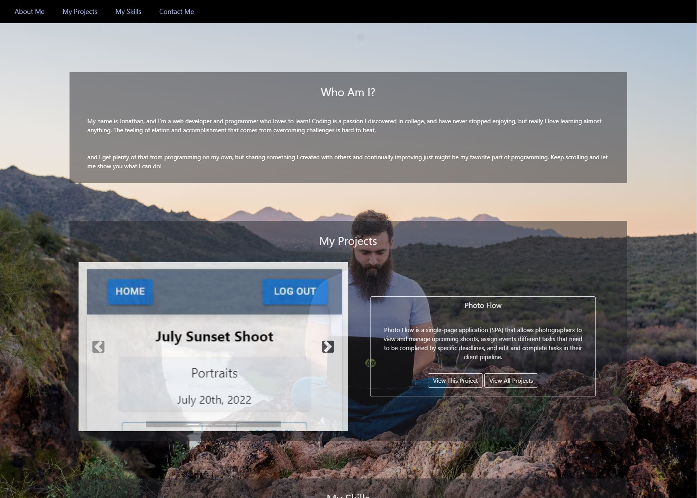

# MY Portfolio

## What it is:
* A description of myself and what I do
* A collection of my projects I've built or worked on
* How to reach out and contact me

## What it looks like:

## The deployed project:
https://lumberjon1.github.io/Portfolio/